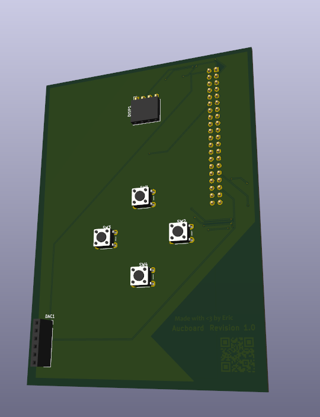
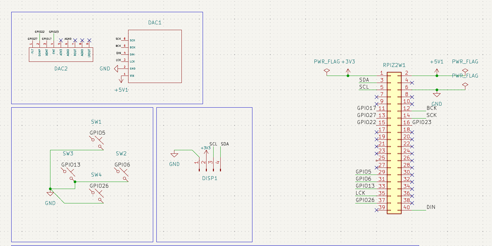
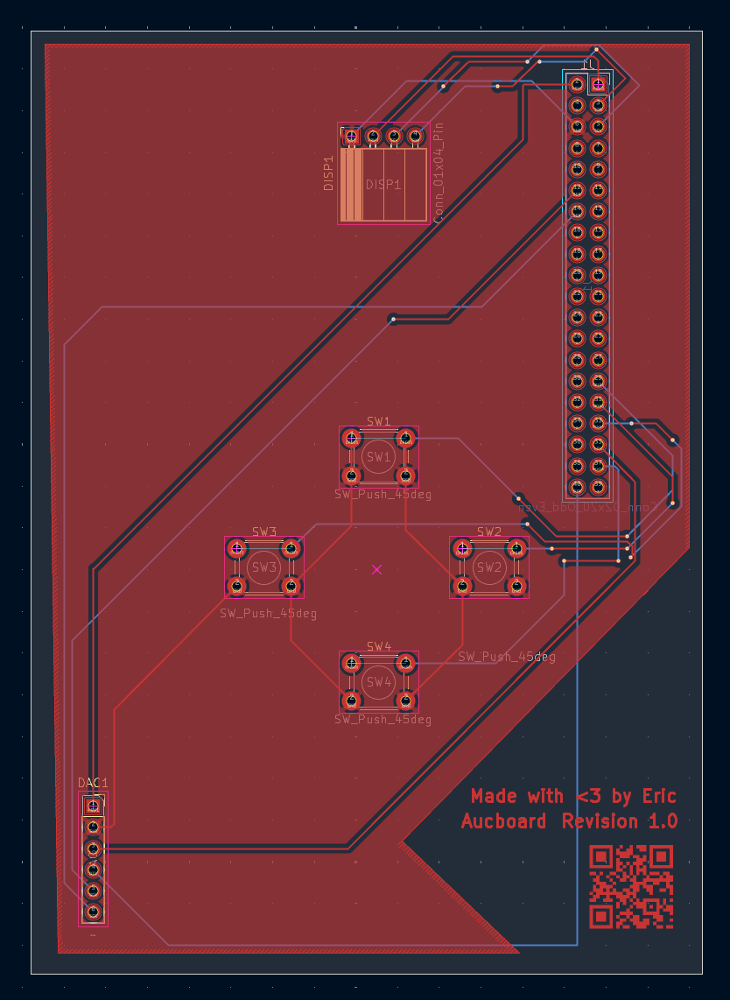
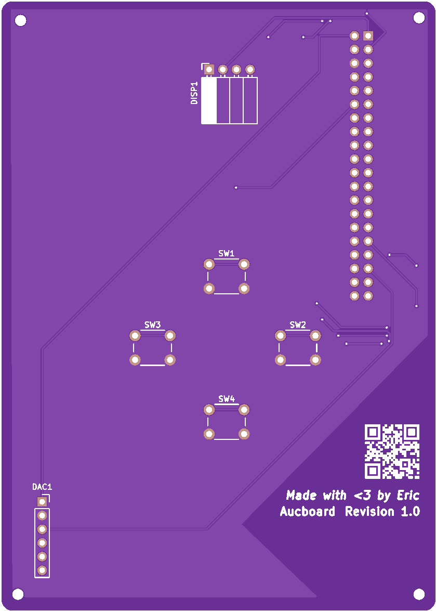
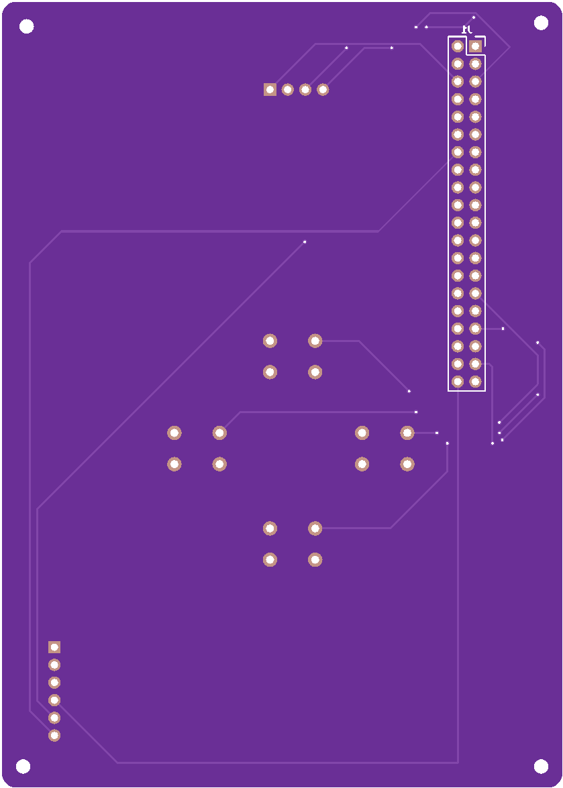

# Aucboard

> [!NOTE]
> This is my first ever hardware project involving CAD/PCB design, if there are any issues you can create one: [Create an issue](https://github.com/JustAnEric/aucboard/issues/new)

Aucboard in its design aims to provide **high fidelity**, 384KHz audio to listeners in a small package.

The hardware I am using/have used to make this project possible:

| Link | Supplier/Seller | Approx. Price |
|------|-----------------|---------------|
| [Common PCM5102A DAC breakout board](https://www.amazon.com.au/VGOL-GY-PCM5102-Compatible-Ardu-inos-Raspberry/dp/B0F631QSCH) | Amazon AU | ~A$20.39 |
| [Raspberry Pi(R) Zero 2 W](https://www.raspberrypi.com/products/raspberry-pi-zero-2-w) | Hack Club (find options near you) | ~US$15.00 |
| [SSD1306 Monochrome OLED display](https://www.amazon.com.au/s?k=ssd1306) | Find options near you | ~A$15.00 - ~A$25.00 |
| Total | | A$69.89 - A$79.89 |

> [!IMPORTANT]
> ***For the perspective of Hack Club's Half Life, I have already bought the Common PCM5102A DAC breakout board, Raspberry Pi(R) Zero 2 W and the SSD1306 Monochrome OLED display myself. PCB manufacturing and fabrication costs are going to be receiving the most funding for this project.***

Tools used:

* KiCAD

The optimal fabrication solution I figured was JLCPCB, as PCBWay can charge $5-10 more per board. If you end up building this yourself, make sure to factor in those costs and whether you'd like PCBA, or manual work. For me, I'll be using PCBA.

## Board revisions

This section will go into the design process of the board.

### Rev 1

The very simplistic schematic of the board is shown below, as it was in V1 (forgetting DAC2, GPIO27, GPIO22, GPIO17, GPIO23 and AGND, I was setting up layouts for an amplifier)

* RPIZ2W1 is the header for the Raspberry Pi Zero 2 W's GPIO connections,
* GPIO5, GPIO6, GPIO13 and GPIO26 are connected to SW1-SW4,
* DISP1 is the SSD1306 OLED display module,
* DAC1 is the 6 pins the DAC provides for outputting a basic line-level signal from its preinstalled AUX jack

And a bit of placement magic onto the PCB, including a ground plane with a 0.2 mm clearance, 0.3 mm thermal relief gap and solid pad connections for some shielding:

(The text and barcode was on the F.Cu layer, I didn't know this at the time and I fixed it to F.Silkscreen instead...)

So afterwards, the PCB would look like this:

I tried my best to keep the DIN cable routed at the back and short, I wanted minimal crosstalk between the power and signal lines as is typical practice when making boards like this. Constraints required me to use a lot of vias as you can see via the dots on traces (as shown in KiCAD).

#### Flaws with this current design

This PCB has no real amplification to it. So, the line-level signal coming out from the DAC would actually fail to drive basic headphones properly unfortunately. Another design is needed, and note to self for next time:
* I should fill up as much board space as I can,
* Maybe put the amplifier next to the display,
* Optimize my traces a little more by shortening them and planning out better paths, for the amplifier this is especially important....

## Software journaling

The software implemented right now at [firmware/](firmware/) is very basic, and definitely needs greater development. Though, the greatest achievement I'm proud of is how `miniaudio` plays audio so smoothly on constrained devices. Furthermore, I can edit the audio stream *in software* rather than constantly configuring a tool like `pactl` filters.

In the first few commits, `pygame` was implemented due to its simpler `pygame.mixer`, but if I kept it like that, audio quality would've been sacrificed heavily for its simplicity. **Heavy stuttering and jitter** would have occurred for the tests directly because of Python (as the same happens with PyAudio too). Miniaudio simplifies it *way* down for Aucboard.

## Disclaimers!

This is an **ongoing project**, and I have not at all started with software yet. This README right now only shows a basic design, where everything may not be up to date as I revise.